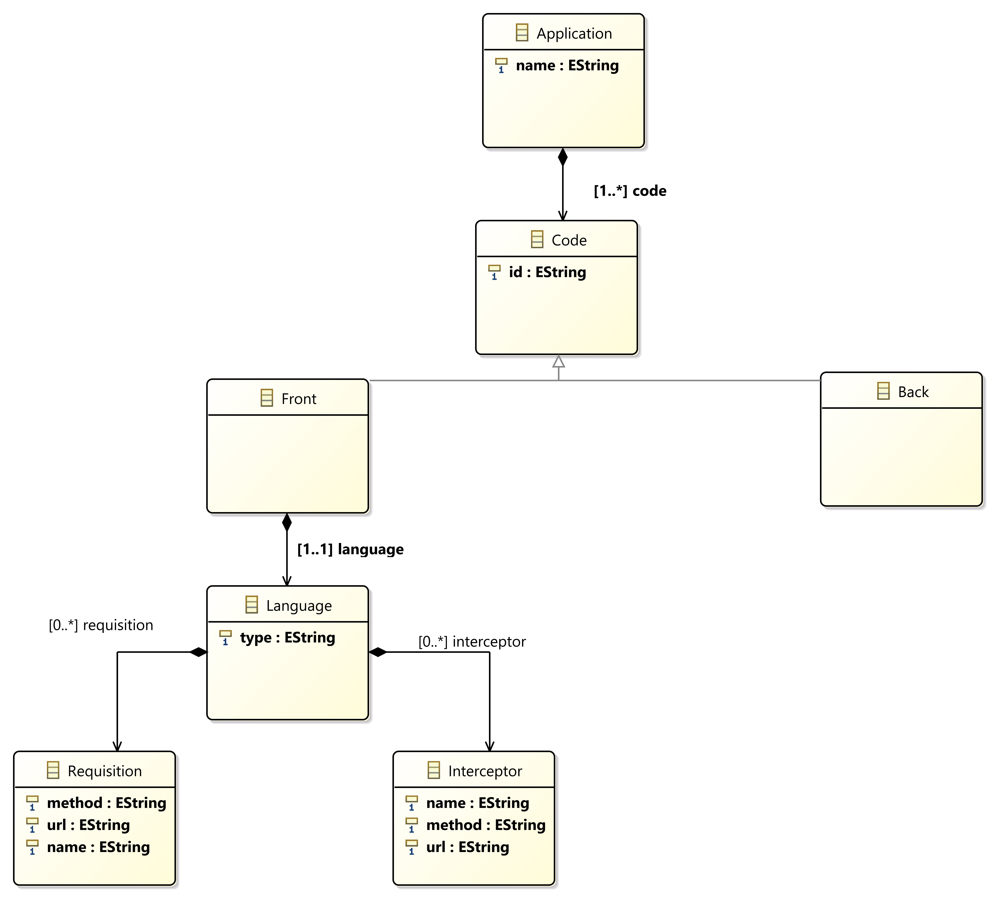

# Webdsl

Projeto voltado para desenvolvimento de uma DSL que permita criação de aplicações voltadas para domínio da web.

O projeto consiste na criação de uma linguagem que permita a fácil especificação na codificação desejada, da linguagem será gerado um código esqueleto para auxiliar o desenvolvimento.

Extensão do arquivo : .mydsl

Como rodar :

   1. Rodar projeto do xtext como aplicação eclipse ->
        - Botão direito em cima do projeto run as -> Eclipse Application
        - Isso ira abrir uma nova instãncia do eclipse
        
   2. Na nova instância do eclipse :
        - Criar um projeto 
        - Criar pasta src
        - Criar arquivo com a extensão .mydsl
        - Escrever no arquivo utilizando a gramática especificada abaixo
        - Salvar arquivo
        - Código é gerado automaticamente ao salvar o arquivo .mydsl
        
## Modelo

## Gramática 

    Application returns Application:
      'Application'
      name=EString
      '{'
        'code' '{' code+=Code ( "," code+=Code)* '}' 
      '}';

    Code returns Code:
      Code_Impl | Front | Back;

    EString returns ecore::EString:
      STRING | ID;

    Code_Impl returns Code:
      'Code'
      '{'
        'id' id=EString
      '}';

    Front returns Front:
      'Front'
      '{'
        'id' id=EString
        'language' language=Language
      '}';

    Back returns Back:
      'Back'
      '{'
        'id' id=EString
      '}';

    Language returns Language:
      'Language'
      '{'
        'type' type=EString
        ('requisition' '{' requisition+=Requisition ( "," requisition+=Requisition)* '}' )?
        ('interceptor' '{' interceptor+=Interceptor ( "," interceptor+=Interceptor)* '}' )?
      '}';

    Requisition returns Requisition:
      'Requisition'
      name=EString
      '{'
        'method' method=EString
        'url' url=EString
      '}';

    Interceptor returns Interceptor:
      'Interceptor'
      name=EString
      '{'
        'method' method=EString
        'url' url=EString
      '}';
### Exemplo
     Application teste1 {
        code { 
            Front {
                id "App1"
                language Language {

                    type "javascript"

                    requisition {
                        Requisition "1" { 
                            method "get"
                            url "http.teste1"
                        }
                    }

                    interceptor {
                        Interceptor "2" {
                            method "get" 
                            url "http.teste1"
                        }

                    }
                }
            }
        }
    }
